# Augentis Labs Architecture

## System Overview

The Augentis Labs MVP is a 5-phase AI-driven product development system that guides ventures from initial concepts through full deployment. Each phase produces artifacts that feed into the next phase through quality gates.

---

## 1. High-Level System Architecture


---

## 2. Discover Phase Architecture


---

## 3. Define Phase Architecture

```mermaid
graph LR
    subgraph "Input"
        INPUT["Market Research<br/>from Discover"]
    end

    subgraph "Define Phase Agents"
        A1["Interview<br/>Ingestion"]
        A2["Persona<br/>Builder"]
        A3["Requirements<br/>Generator"]
        A4["Business Model<br/>Validator"]
        A5["VCD<br/>Assembler"]
    end

    subgraph "Define Artifacts"
        AR1["Interview Notes"]
        AR2["3-5 Personas"]
        AR3["50-100 User Stories"]
        AR4["Business Model"]
        AR5["PRD v2"]
    end

    subgraph "Quality Gate"
        GATE["VCD Gate<br/>10 Indicators"]
    end

    INPUT --> A1
    A1 --> AR1
    AR1 --> A2
    A2 --> AR2
    AR2 --> A3
    A3 --> AR3
    AR3 --> A4
    A4 --> AR4
    AR4 --> A5
    A5 --> AR5

    AR2 --> GATE
    AR3 --> GATE
    AR4 --> GATE
    AR5 --> GATE

    GATE -->|Score ≥ PASS| D3["→ DESIGN Phase"]

    style GATE fill:#ff9800
    style D3 fill:#4caf50
```



---

## 4. Design Phase Architecture

```mermaid
graph LR
    subgraph "Input"
        INPUT["PRD + Personas<br/>from Define"]
    end

    subgraph "Design Phase Agents"
        A1["UX<br/>Agent"]
        A2["Architecture<br/>Designer"]
        A3["Design System<br/>Builder"]
        A4["Branding<br/>Agent"]
        A5["Journey Mapper<br/>Agent"]
        A6["DSP<br/>Assembler"]
    end

    subgraph "Design Artifacts"
        AR1["Wireframes"]
        AR2["C4 Architecture<br/>Context/Container/Component"]
        AR3["Design System<br/>50+ Components"]
        AR4["Brand Guidelines"]
        AR5["Journey Maps<br/>3-5 per persona"]
        AR6["API Spec<br/>OpenAPI 3.0"]
    end

    subgraph "Quality Gate"
        GATE["DSP Gate<br/>8 Components"]
    end

    INPUT --> A1
    INPUT --> A2
    A1 --> AR1
    A2 --> AR2
    A2 --> AR6
    A3 --> AR3
    A4 --> AR4
    A5 --> AR5

    AR1 --> A6
    AR2 --> A6
    AR3 --> A6
    AR4 --> A6
    AR5 --> A6
    AR6 --> A6

    A6 --> GATE

    GATE -->|Score ≥ PASS| D4["→ DEVELOP Phase"]

    style GATE fill:#ff9800
    style D4 fill:#4caf50
```



---

## 5. Develop Phase Architecture

```mermaid
graph LR
    subgraph "Input"
        INPUT["Architecture + API Spec<br/>from Design"]
    end

    subgraph "Code Generation Agents"
        A1["Backend<br/>Generator"]
        A2["Frontend<br/>Generator"]
        A3["Test<br/>Generator"]
        A4["Schema<br/>Generator"]
        A5["Code Generator<br/>Service"]
    end

    subgraph "Quality Agents"
        Q1["Security<br/>Scanner"]
        Q2["Performance<br/>Profiler"]
    end

    subgraph "Generated Artifacts"
        AR1["NestJS Backend<br/>All Endpoints"]
        AR2["Next.js Frontend<br/>Components"]
        AR3["Test Suite<br/>≥80% Coverage"]
        AR4["Prisma Schema"]
    end

    subgraph "Quality Outputs"
        QO1["Vulnerability Report"]
        QO2["Performance Profile"]
    end

    subgraph "Quality Gate"
        GATE["MDP Gate<br/>6 Components"]
    end

    INPUT --> A1
    INPUT --> A2
    INPUT --> A4
    A1 --> AR1
    A2 --> AR2
    A3 --> AR3
    A4 --> AR4

    AR1 --> Q1
    AR1 --> Q2
    AR3 --> Q1
    Q1 --> QO1
    Q2 --> QO2

    AR1 --> GATE
    AR2 --> GATE
    AR3 --> GATE
    QO1 --> GATE
    QO2 --> GATE

    GATE -->|Score ≥ PASS| D5["→ DEPLOY Phase"]

    style GATE fill:#ff9800
    style D5 fill:#4caf50
```



---

## 6. Deploy Phase Architecture


---

## 7. Full Agent Ecosystem (26 Agents)


---

## 8. Quality Gates (4 Gates)

```mermaid
graph LR
    subgraph "VRC Gate - 8 Indicators"
        VRC1["Market Size"]
        VRC2["Trend Momentum"]
        VRC3["Competitor Count"]
        VRC4["Growth Rate"]
        VRC5["TAM"]
        VRC6["SAM"]
        VRC7["SOM"]
        VRC8["Entry Barriers"]
    end

    subgraph "VCD Gate - 10 Indicators"
        VCD1["Market Research Quality"]
        VCD2["Persona Validation"]
        VCD3["Feature Prioritization"]
        VCD4["Business Model"]
        VCD5["Competitive Positioning"]
        VCD6["User Story Completeness"]
        VCD7["PRD Accuracy"]
        VCD8["Requirement Coverage"]
        VCD9["Alignment Score"]
        VCD10["Risk Assessment"]
    end

    subgraph "DSP Gate - 8 Components"
        DSP1["Wireframe Coverage"]
        DSP2["API Spec Completeness"]
        DSP3["Accessibility"]
        DSP4["Security Design"]
        DSP5["Performance Considerations"]
        DSP6["Scalability"]
        DSP7["Compliance"]
        DSP8["Brand Alignment"]
    end

    subgraph "MDP Gate - 6 Components"
        MDP1["Test Coverage ≥80%"]
        MDP2["Security - No Critical"]
        MDP3["Performance <300ms P95"]
        MDP4["Compliance Ready"]
        MDP5["Documentation Complete"]
        MDP6["Deployment Successful"]
    end

    style VRC1 fill:#c8e6c9
    style VCD1 fill:#bbdefb
    style DSP1 fill:#ffe0b2
    style MDP1 fill:#f8bbd0
```



---

## 9. Data Flow & Integration


---

## 10. Technology Stack


---

## 11. Artifact Production Map


---

## 12. Request/Response Flow Example (E2E)


---

## 13. Scalability & Performance


---

## 14. Security Architecture


---

## 15. Organizational Hierarchy (Workspace → Projects)

```mermaid
graph TB
    subgraph "Workspace Level (Organization)"
        WS["🏢 WORKSPACE<br/>Company/Organization"]
        WSM["👥 WORKSPACE_MEMBERS<br/>All team members"]
        WSR["🔐 WORKSPACE_ROLES<br/>Org-level roles<br/>Admin, Lead, Member"]
        WSS["⚙️ WORKSPACE_SETTINGS<br/>Branding, billing, preferences"]
        WSP["💳 WORKSPACE_SUBSCRIPTIONS<br/>Plan tier, project limits"]
    end

    subgraph "Project Level (Products)"
        P["📊 PROJECT<br/>Individual venture/product"]
        PM["👤 PROJECT_MEMBERS<br/>Project-specific team"]
        PR["🔐 PROJECT_ROLES<br/>Project-level roles<br/>Lead, Developer, Viewer"]
    end

    subgraph "Project Execution"
        PH["🔄 PROJECT_PHASES<br/>5D phases"]
        ART["📄 PHASE_ARTIFACTS<br/>Outputs, designs, code"]
        GG["✅ QUALITY_GATES<br/>VRC, VCD, DSP, MDP"]
    end

    WS --> WSM
    WS --> WSR
    WS --> WSS
    WS --> WSP
    WS -->|creates| P

    P --> PM
    P --> PR
    P --> PH
    P --> GG
    PH --> ART

    WSM -->|member of| P
    PM -->|assigned to| P

    style WS fill:#c8e6c9
    style WSM fill:#a5d6a7
    style WSR fill:#81c784
    style WSS fill:#66bb6a
    style WSP fill:#4caf50
    style P fill:#e3f2fd
    style PM fill:#bbdefb
    style PR fill:#90caf9
    style PH fill:#fff3e0
    style ART fill:#ffe0b2
    style GG fill:#ffcc80
```



---

## 15A. Multi-Tenant Access Control

```mermaid
graph TB
    USER["User Login"]

    USER -->|authenticates| AUTH["Auth Service<br/>Supabase Auth"]
    AUTH -->|returns user_id| SESSION["Session Created"]

    SESSION -->|selects workspace| WS["Load Workspace<br/>workspace_id"]
    WS -->|verify membership| CHECK["Check WORKSPACE_MEMBERS<br/>user_id + workspace_id"]
    CHECK -->|yes| LOAD["Load workspace resources<br/>projects, settings, team"]
    CHECK -->|no| DENIED["❌ Access Denied"]

    LOAD -->|selects project| PROJ["Load Project<br/>project_id"]
    PROJ -->|verify membership| CHECK2["Check PROJECT_MEMBERS<br/>user_id + project_id"]
    CHECK2 -->|yes| ALLOWED["✅ Access Granted<br/>Apply role-based permissions"]
    CHECK2 -->|no| DENIED2["❌ Access Denied"]

    ALLOWED -->|query| RLS["PostgreSQL RLS<br/>Enforce row-level security<br/>WHERE workspace_id = X"]
    RLS --> DATA["✅ Return filtered data"]

    style AUTH fill:#c8e6c9
    style WS fill:#e3f2fd
    style CHECK fill:#fff3e0
    style ALLOWED fill:#c8e6c9
    style DENIED fill:#ffcdd2
    style RLS fill:#ffe0b2
```



---

## 16. Database Schema (Entity Relationships)


---

## 16. Database Tables Detail


---

## 17. Deployment Topology (Production Environment)


---

## 18. Deployment Pipeline (CI/CD)


---

## 19. Infrastructure Components & Scaling

```mermaid
graph TB
    subgraph "Auto-Scaling Configuration"
        SCALE1["Frontend: Vercel Auto-scaling<br/>Automatic"]
        SCALE2["Backend: K8s Auto-scaling<br/>Min 2 pods, Max 10 pods<br/>Trigger: CPU >70%, Memory >80%"]
        SCALE3["Database: RDS Aurora Auto-scaling<br/>Compute scaling based on load"]
        SCALE4["Cache: Redis Cluster<br/>Sharded across 3+ nodes"]
    end

    subgraph "Disaster Recovery"
        BACKUP1["Database Backups<br/>Daily full + Hourly incremental"]
        BACKUP2["Application State<br/>Versioned in S3"]
        BACKUP3["Multi-region Standby<br/>Ready in <5 minutes"]
        RTO["RTO: 15 minutes<br/>RPO: 1 hour"]
    end

    subgraph "Performance Optimization"
        OPT1["CDN: Global edge caching<br/>Static assets <100ms"]
        OPT2["Compression: Gzip + Brotli<br/>Images <500KB"]
        OPT3["Database Query Optimization<br/>Indexed, Materialized Views"]
        OPT4["API Response Caching<br/>Redis TTL: 5-60min"]
    end

    subgraph "Capacity Planning"
        CAP1["100 concurrent ventures<br/>≈2-3 K8s pods"]
        CAP2["1000 concurrent API calls/sec<br/>≈5-8 pods"]
        CAP3["Storage: 100 ventures × 500MB<br/>≈50GB + 20% growth buffer"]
    end

    SCALE2 --> CAP1
    BACKUP1 --> RTO
    OPT1 --> OPT2
```

---

## 20. Deployment Architecture - Complete Flow

```mermaid
graph TB
    subgraph "Local Development"
        DEV["Developer Laptop<br/>VS Code + Docker Compose"]
    end

    subgraph "Git Repository"
        REPO["GitHub Repository<br/>Main + Feature Branches"]
    end

    subgraph "Build Pipeline"
        BUILD["Docker Build<br/>Multi-stage"]
        REGISTRY["Container Registry<br/>Docker Hub / ECR"]
    end

    subgraph "Kubernetes Cluster<br/>(AWS EKS or Google GKE)"
        NS["Namespace: augentis-prod"]
        INGRESS["Ingress Controller<br/>Route traffic"]
        SVC1["Service: API<br/>Internal Load Balancer"]
        POD1["Pod Replica Set<br/>NestJS x 2-10"]
        SVC2["Service: Workers<br/>Internal"]
        POD2["Pod Replica Set<br/>BullMQ Workers"]
    end

    subgraph "Data Persistence"
        PVC["Persistent Volume<br/>Redis, Temp Files"]
        DB["PostgreSQL<br/>Supabase Managed"]
        S3["S3 Bucket<br/>Artifacts"]
    end

    subgraph "Frontend Deployment"
        VERCEL["Vercel Edge<br/>Next.js Deployment"]
        CDN["Global CDN<br/>99.99% availability"]
    end

    subgraph "External Integrations"
        CLAUDE_API["Claude API<br/>LLM Processing"]
        GITHUB_API["GitHub API<br/>Deployment Triggers"]
    end

    DEV --> REPO
    REPO -->|Push| BUILD
    BUILD --> REGISTRY

    REGISTRY -->|Deploy| NS
    NS --> INGRESS
    INGRESS --> SVC1
    SVC1 --> POD1
    INGRESS --> SVC2
    SVC2 --> POD2

    POD1 --> PVC
    POD2 --> PVC
    POD1 --> DB
    POD1 --> S3

    REPO -->|Auto-deploy| VERCEL
    VERCEL --> CDN

    POD1 --> CLAUDE_API
    REPO --> GITHUB_API

    style DEV fill:#e8f5e9
    style BUILD fill:#fff3e0
    style NS fill:#e3f2fd
    style POD1 fill:#fff3e0
    style VERCEL fill:#e3f2fd
    style DB fill:#c8e6c9
    style CLAUDE_API fill:#f3e5f5
```

---

## Summary Statistics

| Metric                  | Value                                         |
| ----------------------- | --------------------------------------------- |
| **Total Phases**        | 5 (Discover, Define, Design, Develop, Deploy) |
| **Total Agents**        | 26                                            |
| **Quality Gates**       | 4 (VRC, VCD, DSP, MDP)                        |
| **API Endpoints**       | 31                                            |
| **Frontend Components** | 50+                                           |
| **Test Tasks**          | 36+                                           |
| **Total MVP Tasks**     | 192                                           |
| **Sprints**             | 8 (S1-S8)                                     |
| **Target Time**         | ~3 hours (E2E)                                |
| **Max Concurrency**     | 100 ventures                                  |
| **Database Tables**     | 15+ core tables                               |
| **K8s Pods Range**      | 2-10 (auto-scaling)                           |
| **RTO**                 | 15 minutes                                    |
| **RPO**                 | 1 hour                                        |
| **Frontend Latency**    | <100ms (CDN)                                  |
| **API Response Time**   | <300ms P95                                    |
